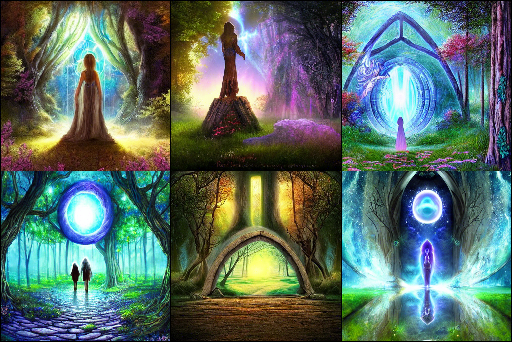
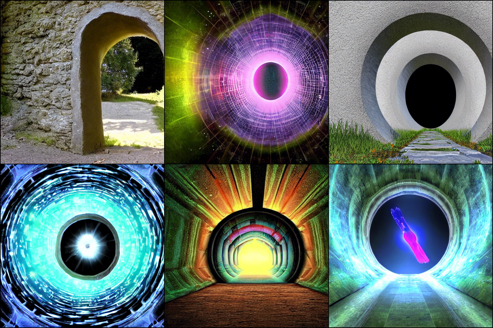
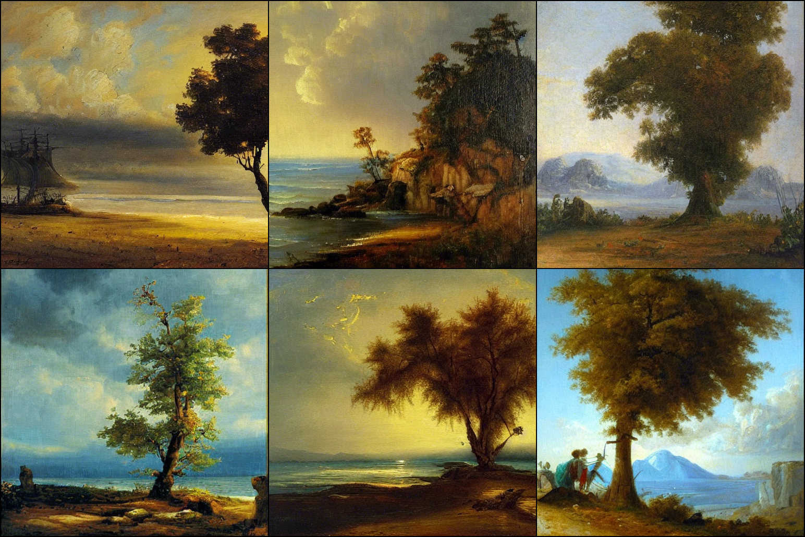
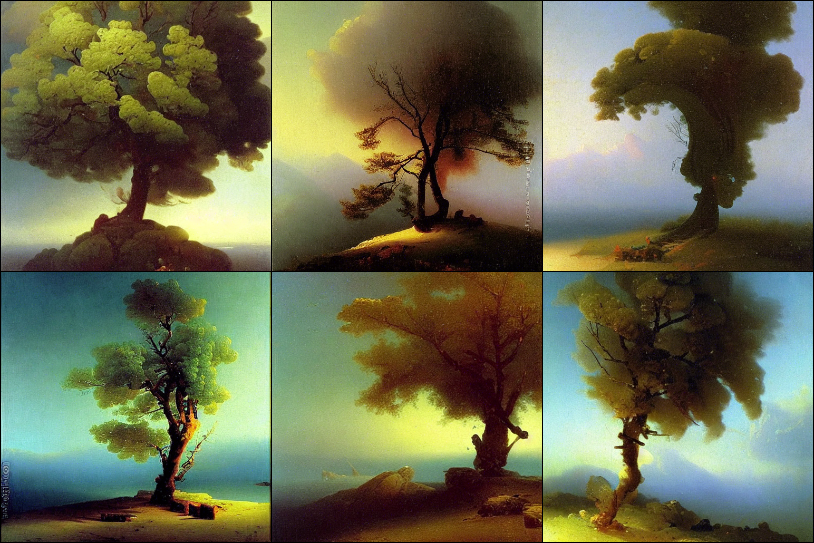
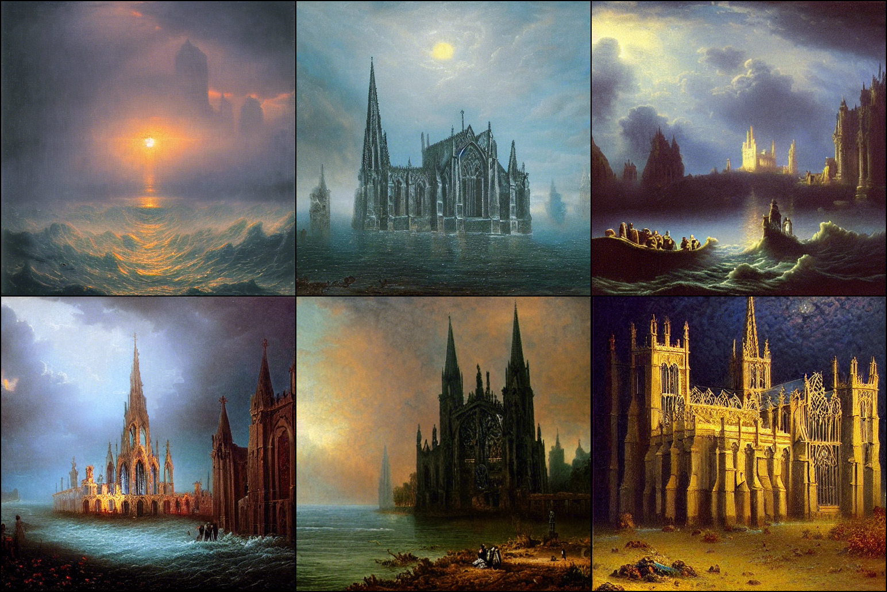
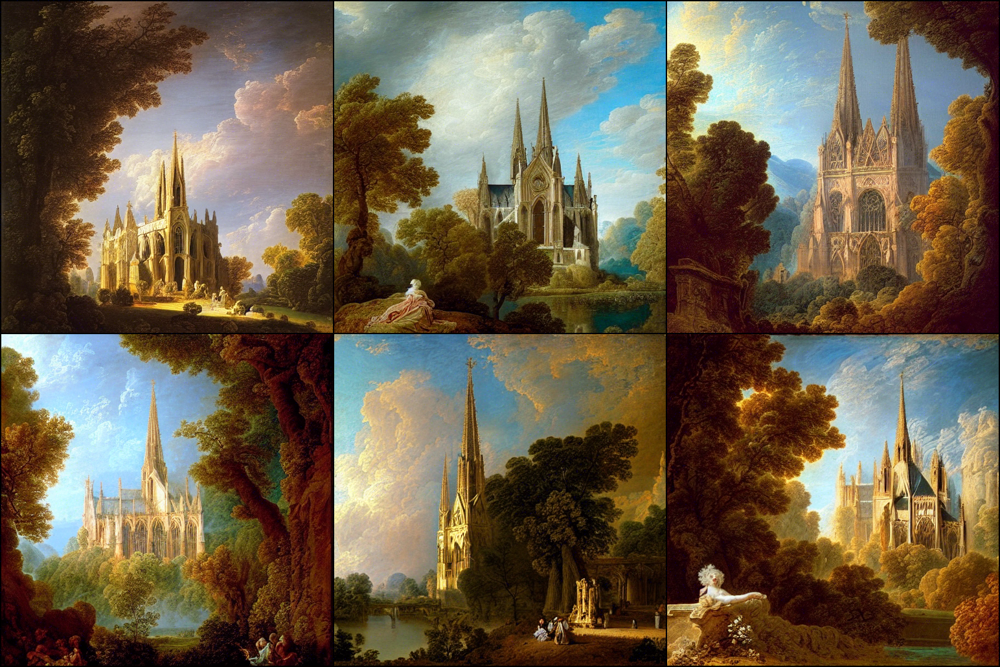
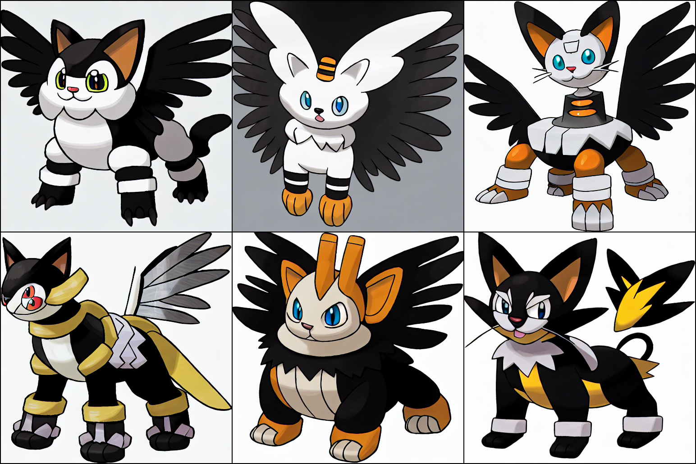
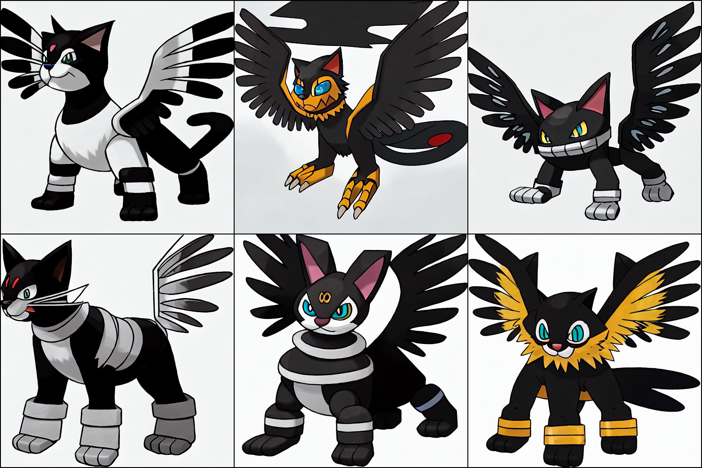
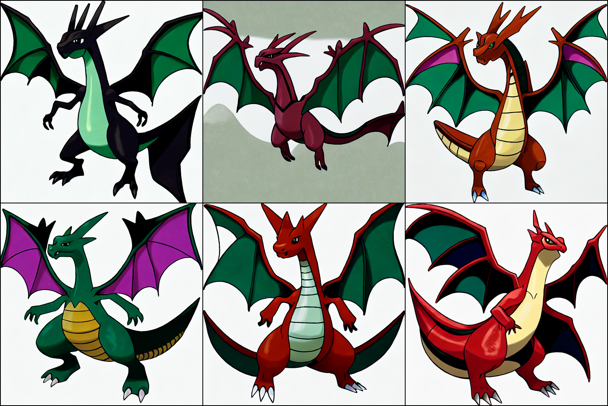
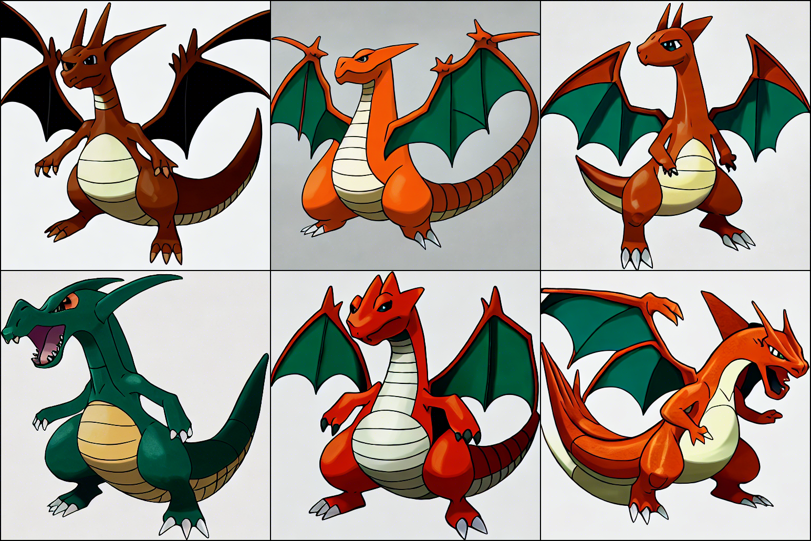

# Stable Diffusion with Aesthetic Gradients 

This is the codebase for the article [Personalizing Text-to-Image Generation via Aesthetic Gradients](https://arxiv.org/abs/2209.12330):

> This work proposes aesthetic gradients, a method to personalize a CLIP-conditioned diffusion model by guiding the generative process towards custom aesthetics defined by the user from a set of images. The approach is validated with qualitative and quantitative experiments, using the recent stable diffusion model and several aesthetically-filtered datasets.

In particular, this reposiory allows the user to use the aesthetic gradients technique described in the previous paper to personalize stable diffusion.


## Prerequisites

This is a fork of the original stable-diffusion repository, so the prerequisites are the same as the [original repository](https://github.com/CompVis/stable-diffusion/). In particular, when cloning this repo, install the library as:

```bash
pip install -e .
```

## Usage 

You can use the same arguments as with the original stable diffusion repository. The script `scripts/txt2img.py` has the additional arguments:

- `--aesthetic_steps`: number of optimization steps when doing the personalization. For a given prompt, it is recommended to start with few steps (2 or 3), and then gradually increase it (trying 5, 10, 15, 20, etc). The greater the value, the more the resulting image will be biased towards the aesthetic embedding.
- `--aesthetic_lr`: learning rate for the aesthetic gradient optimization. The default value is 0.0001. This value almost usually works well enough, so you can just only tune the previous argument.
- `--aesthetic_embedding`: path to the stored pytorch tensor (.pt format) containing the aesthetic embedding. It must be of shape 1x768 (CLIP-L/14 size). See below for computing your own aesthetic embeddings.

In this repository we include all the aesthetic embeddings used in the paper. All of them are in the directory `aesthetic_embeddings`:
* sac_8plus.pt
* laion_7plus.pt
* aivazovsky.pt
* cloudcore.pt
* gloomcore.pt
* glowwave.pt

See the paper to see how they were obtained.

### Examples

Let's see some examples now. This would be with the un-personalized, original SD model:

```bash
python scripts/txt2img.py --prompt "Roman city on top of a ridge, sci-fi illustration by Greg Rutkowski #sci-fi detailed vivid colors gothic concept illustration by James Gurney and Zdzislaw Beksiński vivid vivid colorsg concept illustration colorful interior" --seed 332 --plms  --aesthetic_steps 0 --W 768 --aesthetic_embedding aesthetic_embeddings/laion_7plus.pt
```


If we now personalize it with the LAION embedding, note how the images get more floral patterns, as this is one common pattern of the LAION aesthetics dataset:

```bash
python scripts/txt2img.py --prompt "Roman city on top of a ridge, sci-fi illustration by Greg Rutkowski #sci-fi detailed vivid colors gothic concept illustration by James Gurney and Zdzislaw Beksiński vivid vivid colorsg concept illustration colorful interior" --seed 332 --plms  --aesthetic_steps 5 --W 768 --aesthetic_embedding aesthetic_embeddings/laion_7plus.pt
```


Increasing the number of steps more...

```bash
python scripts/txt2img.py --prompt "Roman city on top of a ridge, sci-fi illustration by Greg Rutkowski #sci-fi detailed vivid colors gothic concept illustration by James Gurney and Zdzislaw Beksiński vivid vivid colorsg concept illustration colorful interior" --seed 332 --plms  --aesthetic_steps 8 --W 768 --aesthetic_embedding aesthetic_embeddings/laion_7plus.pt
```


Let's see another example:

```bash
python scripts/txt2img.py --prompt "A portal towards other dimension" --plms  --seed 332 --aesthetic_steps 15 --aesthetic_embedding aesthetic_embeddings/sac_8plus.pt
```


If we increase it to 20 steps, we get a more pronounced effect:

```bash
python scripts/txt2img.py --prompt "A portal towards other dimension" --plms  --seed 332 --aesthetic_steps 20 --aesthetic_embedding aesthetic_embeddings/sac_8plus.pt
```



We can set the steps to 0 to get the outputs for the original stable diffusion model:

```bash
python scripts/txt2img.py --prompt "A portal towards other dimension" --plms  --seed 332 --aesthetic_steps 0 --aesthetic_embedding aesthetic_embeddings/sac_8plus.pt
```



Note that since we have used the SAC dataset for the personalization, the optimized results are more biased towards fantasy aesthetics.

Now we turn to another example. 

To see more examples, have a look at https://arxiv.org/abs/2209.12330

## Using your own embeddings

If you want to use your own aesthetic embeddings from a set of images, you can use the script `scripts/gen_aesthetic_embedding.py`. This script takes as input a directory containing images, and outputs a pytorch tensor containing the aesthetic embedding, so you can use it as in the previous commands. 

Some examples with three works from the painter Aivazovsky: [reference_images/aivazovsky](reference_images/aivazovsky)

```bash
python scripts/txt2img.py --prompt "a painting of a tree, oil on canvas" --plms  --seed 332 --aesthetic_steps 50 --aesthetic_embedding aesthetic_embeddings/aivazovsky.pt
```



Note that just adding the modifier "by Aivazoysky" to the prompt does not work so well:

```bash
python scripts/txt2img.py --prompt "a painting of a tree, oil on canvas by Aivazovsky" --plms --seed 332 --aesthetic_steps 0 --aesthetic_embedding aesthetic_embeddings/aivazovsky.pt
```



Another example, mixing the styles of two painters (one in the prompt, the other as the aesthetic embedding):

```bash
96 python scripts/txt2img.py --prompt "a gothic cathedral in a stunning landscape by Jean-Honoré Fragonard" --plms --seed 139782398 --aesthetic_steps 12 --aesthetic_embedding aesthetic_embeddings/aivazovsky.pt
```


Whereas the original SD would output this:

```bash
python scripts/txt2img.py --prompt "a gothic cathedral in a stunning landscape by Jean-Honoré Fragonard" --plms --seed 139782398 --aesthetic_steps 0 --aesthetic_embedding aesthetic_embeddings/aivazovsky.pt
```



## Using it with other fine-tuned SD models

The aesthetic gradients technique can be used with any fine-tuned SD model. 

* For example, you can use it with the [Pokemon finetune](https://replicate.com/lambdal/text-to-pokemon):

```bash
python scripts/txt2img.py --prompt "robotic cat with wings" --plms --seed 7 --ckpt ../stable-diffusion/ema-only-epoch\=000142.ckpt  --aesthetic_steps 15 --aesthetic_embedding aesthetic_embeddings/laion_7plus.pt
```



The previous prompt was personalized with the LAION aesthetics embedding, so it has more childish-like than using just the original model:

```bash
python scripts/txt2img.py --prompt "robotic cat with wings" --plms --seed 7 --ckpt ../stable-diffusion/ema-only-epoch\=000142.ckpt  --aesthetic_steps 0 --aesthetic_embedding aesthetic_embeddings/laion_7plus.pt
```


Another example:

```bash

python scripts/txt2img.py --prompt "Dragonite" --plms --seed 7 --ckpt ../stable-diffusion/ema-only-epoch\=000142.ckpt  --aesthetic_steps 10 --aesthetic_embedding aesthetic_embeddings/sac_8plus.pt
```



```bash

python scripts/txt2img.py --prompt "Dragonite" --plms --seed 7 --ckpt ../stable-diffusion/ema-only-epoch\=000142.ckpt  --aesthetic_steps 0 --aesthetic_embedding aesthetic_embeddings/sac_8plus.pt
```




* Using NovelAI weights, some experiments were performed here in this post (See Update October 15th): [https://www.zhihu.com/question/558019952/answer/2708668441](https://www.zhihu.com/question/558019952/answer/2708668441)


## Using it from Web UI

There is a PR here: [https://github.com/AUTOMATIC1111/stable-diffusion-webui/pull/2585](https://github.com/AUTOMATIC1111/stable-diffusion-webui/pull/2585)


## Further resources

* Introduction to the aesthetic gradients method (blog post): [https://metaphysic.ai/custom-styles-in-stable-diffusion-without-retraining-or-high-computing-resources/](https://metaphysic.ai/custom-styles-in-stable-diffusion-without-retraining-or-high-computing-resources/)
* Experiments using the NovelAI leaked weights: [https://www.zhihu.com/question/558019952/answer/2708668441](https://www.zhihu.com/question/558019952/answer/2708668441)


## Citation

If you find this is useful for your research, please cite our paper:

```
@article{gallego2022personalizing,
  title={Personalizing Text-to-Image Generation via Aesthetic Gradients},
  author={Gallego, Victor},
  journal={arXiv preprint arXiv:2209.12330},
  year={2022}
}
```


